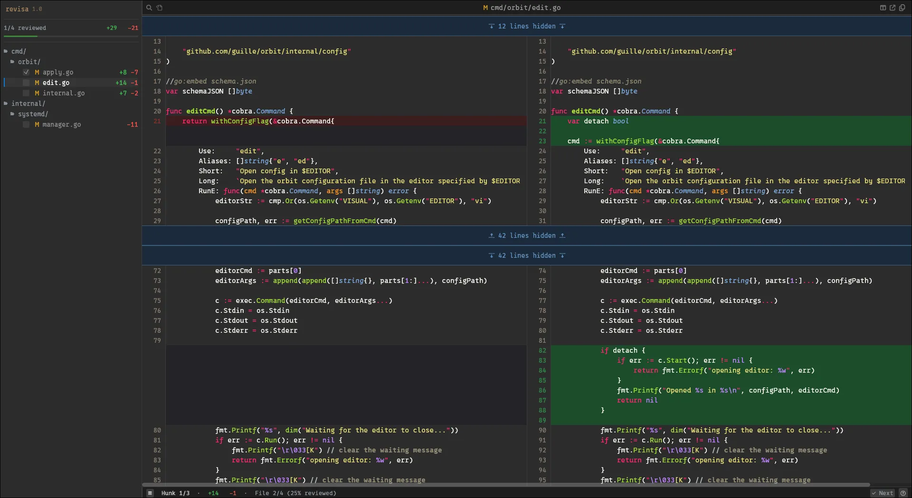

# revisa

Revisa is a Linux GUI (X11/Wayland) tool for viewing diffs between two directories.



*More screenshots available in [the website](https://revisa.guillerg.dev/)*

## Installation

### From GitHub releases

Using mise:

```sh
# note, this only installs the revisa binary, not git-revisa
mise use --global github:guille/revisa
```

Or manually download the latest release from [GitHub Releases](https://github.com/guille/revisa/releases). Extract the archive and place both `revisa` and `git-revisa` somewhere on your `PATH`:

```sh
tar xzf revisa_v*_linux_amd64.tar.gz
sudo install -m 755 revisa_*/revisa revisa_*/git-revisa /usr/local/bin/
```

### From source

Requires Rust 1.85+:

```sh
cargo install --git https://github.com/guille/revisa.git
```

*Note*: `cargo install` only installs the `revisa` binary. For the `git-revisa` wrapper, grab it from the repo or a release archive.

Alternatively, clone and build manually:

```sh
git clone https://github.com/guille/revisa.git
cd revisa
cargo build --release
# Binary at target/release/revisa
```

## Usage

Revisa is meant to be used as a git difftool, but it also works standalone.

### Git difftool

The easiest way is to put [git-revisa](git-revisa) in your path, which will configure a difftool and can integrate with the gh cli.

For manual configuration, put this in your gitconfig:

```
[difftool "revisa"]
    cmd = revisa --left "$LOCAL" --right "$REMOTE"
```

You can then call it like `git difftool -d -t revisa` with the same arguments as you'd normally pass. **Don't forget** the `-d` (short for `--dir-diff`). Without it, git tries to call revisa file by file, which will not work.

### Standalone

Revisa will work to review differences between any two directories. You can start it like this:

```sh
revisa diff --recheck --left example/left --right example/right/
```

Note the `--recheck` flag. Without it we trust that Git has done the initial pass for us and every file has _some_ sort of change. The flag tells revisa to check and skip identical files (by content and permissions).

## Features

- Fast.
- Hunk navigation.
- Keyboard-friendly interface, with configurable keybinds.
- Side-by-side or unified diff modes.
- Exclude directory from diff.
- Quick picker and go-to line to quickly navigate the diff.
- Search across all files.
- Rename and permission changes detection.
- Folding of unchanged regions.

## Customization

I created revisa for personal use. I've been reviewing more code (guess why), Github keeps struggling and none of the tools I tried worked as I wanted them to[^1]. I don't want to make this a _product_, I just put it out there in case someone else finds it useful, but I likely won't implement feature requests or fix bugs if I don't run into them or make sense to me.

[^1]: [Hunk](https://github.com/modem-dev/hunk) seems pretty close to what I was looking for, but I only heard about it later.

Furthermore, since revisa is very tailored to _my_ use case, it has the sort of defaults that make me not need any configuration. That being said, I have tried to expose enough customization that other people can get to a nice enough UX adjusting some knobs.

### Settings

Revisa accepts many tweaks to the look and behavior of the app. These can be configured with a TOML file. By default, it will be in `XDG_CONFIG_DIR/revisa/config.toml`, with a fallback to `~/.config/revisa/config.toml`.

You can use a custom path by passing the `--config` flag to the diff subcommand.

See [SETTINGS.md](SETTINGS.md) for all configurable options.

The main pain point for most people will likely be the font face. It defaults to the system's `monospace` and defaults nerdfont icons to true. Most people won't have a nerdfont configured as the system default, so you will see a lot of boxes. You can either change your system's monospace font using fontconfig or set `font.face` through the settings. I do recommend a nerdfont, I haven't put a lot of effort into the ASCII fallback!

### Syntaxes

Revisa uses syntect to perform syntax highlighting. The binary ships with:
- [Sublime Text's default syntaxes](https://github.com/sublimehq/Packages/). These cover most mainstream languages.
- Some extra syntaxes for languages I use.

If you want to add more syntaxes, you can do that by putting `*.sublime-syntax` files inside `XDG_CONFIG_DIR/revisa/syntaxes/` and running `revisa build-cache`.

In the future revisa will support automatically loading syntaxes from [bat](https://github.com/sharkdp/bat/) if it is installed on the system. It is already implemented but revisa uses an unreleased version of syntect and the dumps are not compatible.

### Themes

Revisa only ships one theme by default. You can configure your own theme via the setting `behaviour.theme`. Themes use plist format. Themes only affect syntax highlighting, so you will likely need to also adjust the app's colors to match your preferred look.

## License

[MIT](LICENSE.md)
